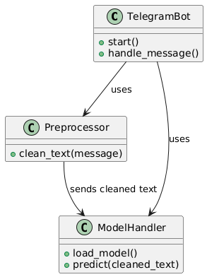

# TeleGuard AI

[](https://www.docker.com/)
[](https://www.python.org/)
[](https://github.com/ibrahimify/teleguard-ai/actions)

TeleGuard AI is a **real-time Telegram bot** that flags spam messages using an ensemble **TF–IDF + Voting Classifier (Logistic Regression, Naive Bayes, and XGBoost)** trained on 50k+ labeled SMS messages.  
It is containerized using **Docker** and continuously integrated and deployed with **GitHub Actions CI/CD**.

---

## Features

-  **Spam/Ham Prediction** using ML model (F1 Score: 0.93)
-  **Voting Classifier**: Logistic Regression, Naive Bayes, XGBoost
-  **TF–IDF Vectorization**
-  **Dockerized** with minimal Python 3.12 image
-  **Real-time Telegram Bot** response
-  **CI/CD Pipeline** with GitHub Actions

---

## Model Overview

- **Training Data**: 50,000+ SMS messages
- **Preprocessing**: Lowercasing, punctuation/number removal, stopword filtering, stemming
- **Vectorizer**: `TfidfVectorizer`
- **Classifier**: `VotingClassifier` (soft voting with 3 estimators)
- **Performance**:
  - Accuracy: ~98.74%
  - F1 Score (Spam class): 0.93+

---

## Running Locally with Docker

To run the bot locally, open terminal in the project directory and run:

```bash
python src/bot.py
```

### Build Docker image

```bash
docker build -t teleguard-ai .
```

### Run the bot container

```bash
docker run -e TELEGRAM_BOT_TOKEN=your_token_here teleguard-ai
```

> Replace `your_token_here` with your real bot token or use an `.env` file.

---

## .env File

Create a `.env` file in the root directory:

```env
TELEGRAM_BOT_TOKEN=your_token_here
```

Ensure `.env` is in `.gitignore`.

---

## CI/CD (GitHub Actions)

Every push to `main`:
- Validates the code
- Builds the Docker image
- (Optionally) pushes to Docker Hub

GitHub Secrets used:
- `DOCKER_USERNAME`
- `DOCKER_PASSWORD`
- `TELEGRAM_BOT_TOKEN`

---

## Example Predictions

| Message | Prediction |
|--------|------------|
| "Congratulations! You’ve won a gift card..." | 🚫 Spam |
| "Hey, are we still meeting tomorrow?" | ✅ Ham |
| "Free entry! Text WIN to 80086!" | 🚫 Spam |

### 🚀 Live Bot
Try the live bot here: [@TeleGuardAIBot](https://t.me/TeleGuardAIBot)

---

---

### System Flow


### 🧱 Class Structure

This diagram shows how components interact within TeleGuard AI:


---


## 📂 Project Structure

```
├── src/
│   ├── bot.py               # Telegram bot main script
│   ├── train_model.py       # Training pipeline
│   ├── test_model.py        # Local test runner
├── models/                  # Saved model files
├── data/                    # Raw and preprocessed data
├── assests/                 # diagrams
├── Dockerfile
├── requirements.txt
├── .env                     # Secret token (ignored)
└── .github/workflows/       # GitHub Actions CI/CD
```

---

## Contributing  

Feel free to fork this repository and make improvements.